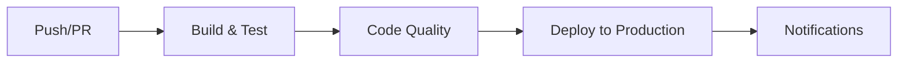

# 🚀 Guia de Configuração CI/CD

## ✅ Pipeline Criado com Sucesso!

O workflow CI/CD foi configurado e está pronto para uso. Este documento contém informações importantes para começar.

## 📋 O que foi implementado

### Arquivos Criados

1. **[.github/workflows/ci-cd.yml](.github/workflows/ci-cd.yml)**
   - Pipeline completo de CI/CD
   - 4 jobs: Build, Quality, Deploy, Notify

2. **[.github/workflows/README.md](.github/workflows/README.md)**
   - Documentação detalhada do pipeline
   - Guias de troubleshooting
   - Sugestões de extensões

## 🎯 Como Funciona

### Fluxo Automático



1. **Você faz push para `main`** → Pipeline inicia automaticamente
2. **Build & Testes** → Compila e testa o código
3. **Análise de Qualidade** → Verifica padrões de código
4. **Deploy** → Gera artefatos e envia para branch `production`
5. **Notificação** → Resumo do status

### Versionamento Automático

Cada deploy gera uma versão única:
```
v20251204-143022-a1b2c3d4
  └─ Data/Hora  └─ SHA do commit
```

## 🔧 Configuração Inicial Necessária

### 1. Habilitar Permissões do GitHub Actions

**IMPORTANTE:** Configure as permissões para que o workflow possa fazer push para a branch `production`.

#### Passo a passo:

1. Vá para: **Settings** → **Actions** → **General**
2. Role até **Workflow permissions**
3. Selecione: **Read and write permissions**
4. Marque: **Allow GitHub Actions to create and approve pull requests**
5. Clique em **Save**

### 2. Criar Branch Production (Opcional)

A branch será criada automaticamente no primeiro deploy, mas você pode criá-la manualmente:

```bash
git checkout -b production
git push origin production
git checkout main
```

### 3. Testar o Pipeline

Faça um commit de teste:

```bash
git add .
git commit -m "test: verificar pipeline CI/CD"
git push origin main
```

Depois, acompanhe em: `https://github.com/SEU-USUARIO/SEU-REPO/actions`

## 📊 Análise do Projeto

### Resumo Técnico

| Item | Detalhes |
|------|----------|
| **Java** | 21 (Eclipse Temurin) |
| **Framework** | Spring Boot 3.3.10 |
| **Build Tool** | Maven (wrapper incluído) |
| **Banco de Dados** | PostgreSQL |
| **API Docs** | SpringDoc OpenAPI 2.6.0 |
| **Testes** | 4 arquivos de teste |

### Estrutura Identificada

```
✅ Controllers: PeopleController, TransactionController
✅ Services: PeopleService, TransactionService
✅ Repositories: PeopleRepository
✅ Entities: People, Transaction
✅ DTOs: RequestTransactionCreate, ResponsePeopleDto, RequestNameUpdate
✅ Testes: JUnit, Integration, RestAssured
✅ Documentação: OpenAPI configurado
✅ Docker: Dockerfile multi-stage build
```

## 💡 Melhorias Recomendadas

### 1. Adicionar JaCoCo para Cobertura de Código

Adicione ao `pom.xml` (dentro de `<build><plugins>`):

```xml
<plugin>
    <groupId>org.jacoco</groupId>
    <artifactId>jacoco-maven-plugin</artifactId>
    <version>0.8.11</version>
    <executions>
        <execution>
            <id>prepare-agent</id>
            <goals>
                <goal>prepare-agent</goal>
            </goals>
        </execution>
        <execution>
            <id>report</id>
            <phase>test</phase>
            <goals>
                <goal>report</goal>
            </goals>
        </execution>
        <execution>
            <id>jacoco-check</id>
            <goals>
                <goal>check</goal>
            </goals>
            <configuration>
                <rules>
                    <rule>
                        <element>PACKAGE</element>
                        <limits>
                            <limit>
                                <counter>LINE</counter>
                                <value>COVEREDRATIO</value>
                                <minimum>0.60</minimum>
                            </limit>
                        </limits>
                    </rule>
                </rules>
            </configuration>
        </execution>
    </executions>
</plugin>
```

**Benefício:** Visualizar cobertura de testes e garantir qualidade mínima.

### 2. Adicionar Application Properties por Ambiente

Crie arquivos de configuração:

```
src/main/resources/
├── application.yml               # Configuração base
├── application-dev.yml          # Desenvolvimento
├── application-test.yml         # Testes
└── application-prod.yml         # Produção
```

**Exemplo `application-dev.yml`:**
```yaml
spring:
  datasource:
    url: jdbc:postgresql://localhost:5432/devdb
  jpa:
    show-sql: true
logging:
  level:
    com.example.demo: DEBUG
```

### 3. Adicionar Spring Boot Actuator

Já está no projeto? Se não, adicione ao `pom.xml`:

```xml
<dependency>
    <groupId>org.springframework.boot</groupId>
    <artifactId>spring-boot-starter-actuator</artifactId>
</dependency>
```

Configure em `application.yml`:
```yaml
management:
  endpoints:
    web:
      exposure:
        include: health,info,metrics
  endpoint:
    health:
      show-details: always
```

**Benefício:** Endpoints de monitoramento para health checks e métricas.

### 4. Adicionar Validação nos Endpoints

Melhore a validação usando Bean Validation:

```java
@PostMapping
public ResponseEntity<ResponseDto> criar(
    @Valid @RequestBody RequestDto request) {
    // ...
}
```

### 5. Implementar Logging Estruturado

Use Lombok para logging:

```java
@Slf4j
@Service
public class PeopleService {
    public People salvar(People people) {
        log.info("Salvando person: {}", people.getId());
        // ...
        log.debug("Person salvo com sucesso");
        return savedPeople;
    }
}
```

### 6. Adicionar Repository para Transaction

Percebi que há `TransactionService` mas pode faltar o repository. Crie:

```java
@Repository
public interface TransactionRepository extends JpaRepository<Transaction, Long> {
    List<Transaction> findByPeopleId(Long peopleId);
}
```

## 🎨 Extensões Opcionais do Pipeline

### Integração com SonarCloud (Gratuito para projetos públicos)

1. Crie conta em: https://sonarcloud.io
2. Adicione o token nos secrets do GitHub
3. Descomente/adicione no workflow:

```yaml
- name: SonarCloud Analysis
  env:
    SONAR_TOKEN: ${{ secrets.SONAR_TOKEN }}
  run: |
    ./mvnw verify sonar:sonar \
      -Dsonar.projectKey=seu-projeto \
      -Dsonar.organization=sua-org \
      -Dsonar.host.url=https://sonarcloud.io
```

### Deploy Automático em Docker Hub

```yaml
- name: Build and Push Docker Image
  run: |
    echo "${{ secrets.DOCKER_PASSWORD }}" | docker login -u "${{ secrets.DOCKER_USERNAME }}" --password-stdin
    docker build -t seu-usuario/app:${{ env.VERSION_TAG }} .
    docker push seu-usuario/app:${{ env.VERSION_TAG }}
```

### Notificações no Slack

```yaml
- name: Slack Notification
  uses: 8398a7/action-slack@v3
  with:
    status: ${{ job.status }}
    webhook_url: ${{ secrets.SLACK_WEBHOOK }}
    text: 'Deploy ${{ env.VERSION_TAG }} completed!'
```

## 🐛 Troubleshooting Comum

### Problema: "Permission denied" ao fazer push para production

**Solução:**
1. Vá em Settings → Actions → General
2. Em "Workflow permissions", selecione "Read and write permissions"
3. Salve e re-execute o workflow

### Problema: Testes falhando no CI mas passam localmente

**Causas comuns:**
- Dependência do banco de dados PostgreSQL
- Variáveis de ambiente não configuradas
- Timezone diferente

**Solução:**
```yaml
# Adicione serviço PostgreSQL no workflow
services:
  postgres:
    image: postgres:15
    env:
      POSTGRES_DB: testdb
      POSTGRES_USER: test
      POSTGRES_PASSWORD: test
    ports:
      - 5432:5432
```

### Problema: Cache não funciona

**Solução:**
- Limpe o cache em: Actions → Caches
- Verifique se o hash do `pom.xml` está correto
- Re-execute o workflow

## 📈 Próximos Passos

1. ✅ **Configure as permissões do GitHub Actions** (obrigatório)
2. ✅ **Faça um commit de teste** para verificar o pipeline
3. ⏭️ **Adicione JaCoCo** para cobertura de código
4. ⏭️ **Configure ambientes** (dev, test, prod)
5. ⏭️ **Integre SonarCloud** para análise de qualidade
6. ⏭️ **Adicione mais testes** para aumentar cobertura

## 🔗 Links Úteis

- [GitHub Actions Documentation](https://docs.github.com/actions)
- [Spring Boot Documentation](https://docs.spring.io/spring-boot/docs/current/reference/html/)
- [Maven Surefire Plugin](https://maven.apache.org/surefire/maven-surefire-plugin/)
- [JaCoCo Documentation](https://www.jacoco.org/jacoco/trunk/doc/)

## 📞 Suporte

Para questões sobre o CI/CD:
1. Verifique a [documentação completa](.github/workflows/README.md)
2. Consulte os logs do GitHub Actions
3. Revise este guia de configuração

---

**Status:** ✅ Pipeline pronto para uso
**Criado em:** 2025-12-04
**Versão:** 1.0.0
